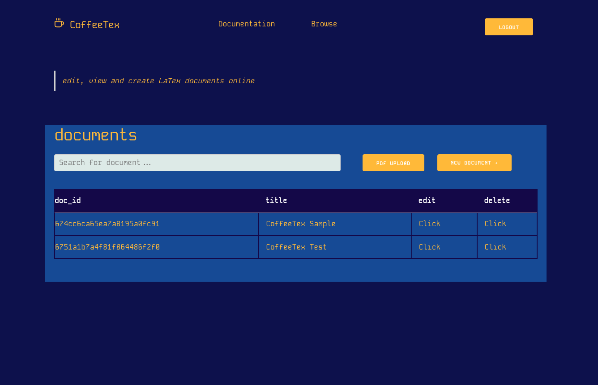
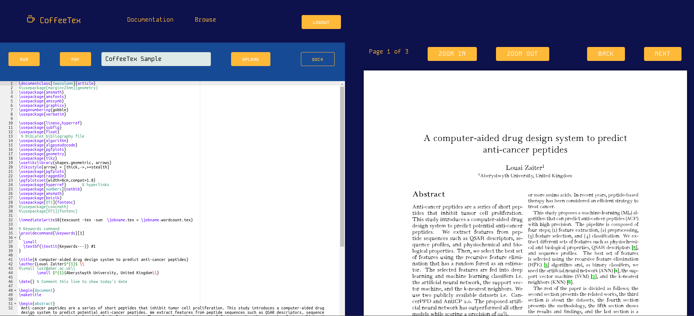

# A LaTex Editor for the web


This repository introduces a LaTex editor built using React JS, Deno, and MongoDB.

# Installation
- To run the project, you just need to install docker and docker-compose. 

### Dependencies (Linux)

```
sudo apt-get update
sudo apt install docker.io
sudo apt-get install docker-compose-plugin
```

### Steps

- Build the backend docker image
```
cd ./backend && docker build -t encrylatexdeno .
```

- Build the frontend docker image
```
cd ../frontend && docker build -t coffeetex .
```

- The docker-compose.yaml file will run three docker containers simultaneously i.e. the backend, the frontend, and the database.

From the root of the project run the following command:
```
docker-compose up
```

- Now you need to navigate to the correct IP address and the application will start.

To know the IP address of the docker container, run the following commands:

```
docker ps
```
That will result in the following output:
```
CONTAINER ID   IMAGE            COMMAND                  CREATED          STATUS          PORTS                                           NAMES
d3f69caf91b3   encrylatexdeno   "/tini -- docker-ent…"   56 seconds ago   Up 56 seconds   0.0.0.0:8000->8000/tcp, :::8000->8000/tcp       thecoffeetexeditor_server_1
644fc6629dd1   coffeetex        "docker-entrypoint.s…"   56 seconds ago   Up 8 seconds    0.0.0.0:3000->3000/tcp, :::3000->3000/tcp       thecoffeetexeditor_client_1
f5b1c015f20b   mongo            "docker-entrypoint.s…"   56 seconds ago   Up 56 seconds   0.0.0.0:27017->27017/tcp, :::27017->27017/tcp   thecoffeetexeditor_mongo_1
```

- Copy the container id of the "coffeetex" image and run:

```
docker inspect YOUR_CONTAINERID | grep "IPAddress"
```

- The docker container have an IP address in the range of 172.19.0.0/16.

- Navigate to docker_ip_address:3000 and the application will start

#### The image below shows the "browse" screen of the web application



#### The second image is the LaTex editor 


##### The features implemented in the latex web editor are:
1. Compiling LaTex code to PDF
2. Compiling LaTex code to MS word format
3. Generating text files from PDF documents.
4. A customized PDF viewer 

#### This code is under MIT License.

